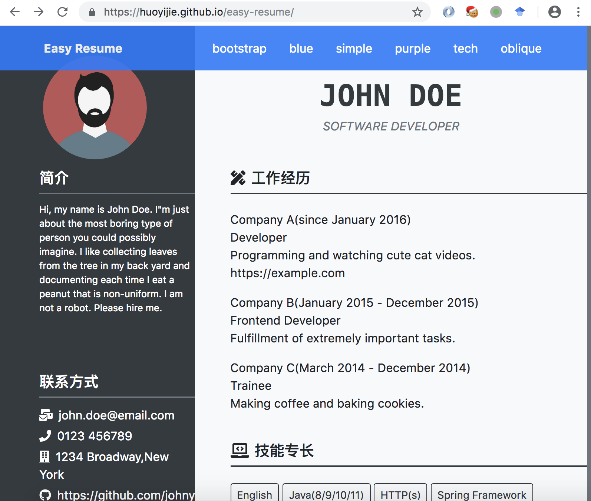

# easy-resume
简历模板，可以快速制作个性化简历，[点击这里可以看效果](https://huoyijie.github.io/easy-resume/)

## 1.clone项目

git clone git@github.com:huoyijie/easy-resume.git

## 2.启动IDE（idea 15)，编译运行

## 3.打开浏览器访问http://localhost:8000/rt-bootstrap-index/john-doe查看demo简历

## 4.生成自己的简历

cd {project.dir}/src/main/resources/static/resume

mkdir YOUR_NAME

cd YOUR_NAME

参考demo简历，编辑新增info.yml，并放置自己的头像图片id.jpg

